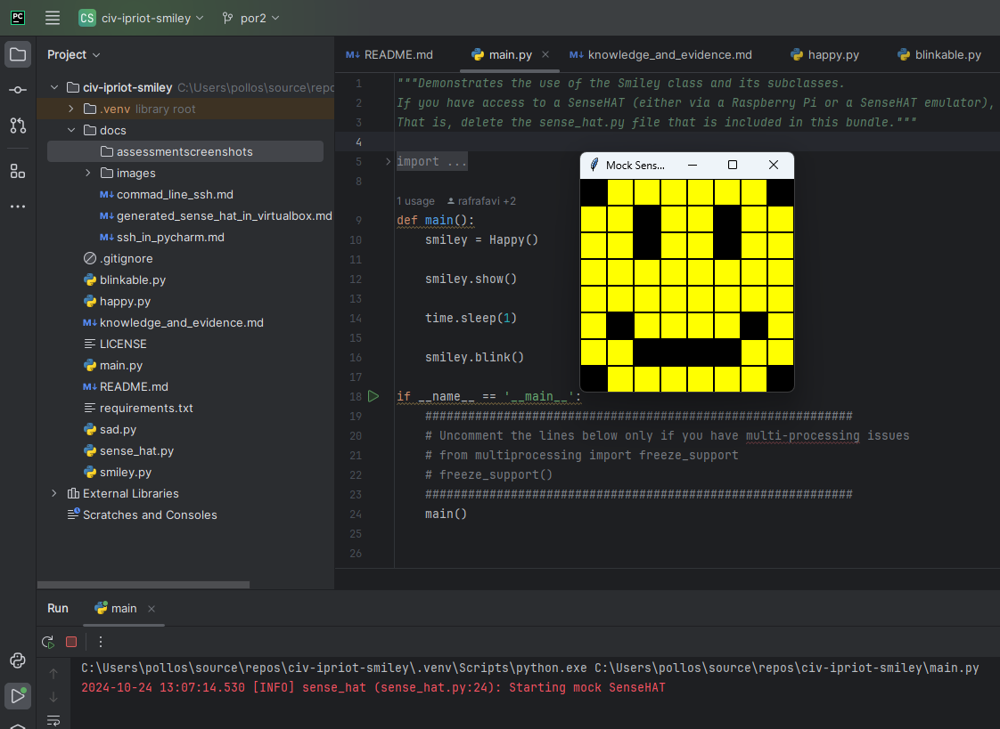
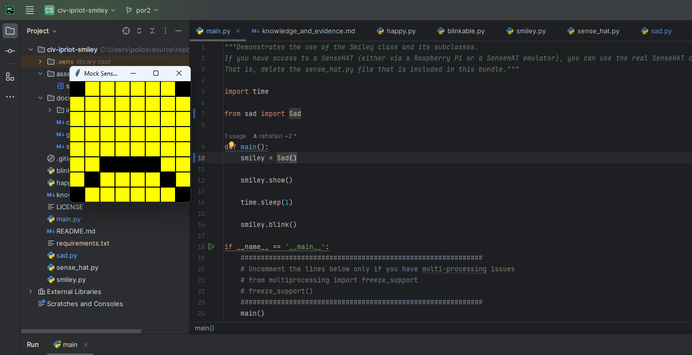

<style>

body {
    counter-reset: h2counter;
}

/* H1 - No numbering */
h1 {
    /* No counter reset or increment */
}

/* H2 - Level 1 numbering */
h2 {
    counter-reset: h3counter;
}

h2::before {
    counter-increment: h2counter;
    content: counter(h2counter) ". ";
}

/* H3 - Level 2 numbering */
h3 {
    counter-reset: h4counter;
}

h3::before {
    counter-increment: h3counter;
    content: counter(h2counter) "." counter(h3counter) " ";
}

/* H4 - Level 3 numbering (optional) */
h4 {
    counter-reset: h5counter;
}

h4::before {
    counter-increment: h4counter;
    content: counter(h2counter) "." counter(h3counter) "." counter(h4counter) " ";
}

</style>

# Evidence and Knowledge

This document includes instructions and knowledge questions that must be completed to receive a *Competent* grade on this portfolio task.

## Required evidence

### Answer all questions in this document

- Each answer should be complete, well-articulated, and within the specified word count limits (if added) for each question.
- Please make sure **all** external sources are properly cited.
- You must **use your own words**. Please include your full chat transcripts if you use generative AI in any way.
- Generative AI hallucinates, is not an authoritative source

### Make all the required modifications to the code

- Please follow the instructions in this document to make the changes needed to the code.

- When requested to upload evidence, upload all screenshots to `screenshots/` and embed them in this document. For example:

```markdown

```

- You must upload the code into your GitHub repository.
- While you can use a branch, your code should be in main when you submit.
- Upload a zip of this repository to Blackboard when you are ready to submit.
- You will be notified of your result via Blackboard
- However, if using GitHub classrooms, you may also receive additional feedback on GitHub directly

### Optional: Use of Raspberry Pi and SenseHat

Raspberry Pi or SenseHat is **optional** for this activity. You can use the included `sense_hat.py` file to simulate the SenseHat on your computer.

If you use a Pi, please **delete** the `sense_hat.py` file.

### Accessible version of the code

This project relies on visual patterns that appear on an LED matrix. If you have any accessibility requirements, you can use the `udl/accessible` branch to complete the project. This branch provides an accessible code version that uses text-based patterns instead of visual ones.

Please discuss this with your lecturer before using that branch.

## Specific Tasks & Questions

Address the following tasks and questions based on the code provided in this repository.

### Set up the project locally

1. Fork this repository (if not using GitHub Classrooms)
2. Clone your repository locally
3. Run the project locally by executing the `main.py` file
4. Evidence this by providing screenshots of the project directory structure and the output of the `main.py` file



If you are running on a Raspberry Pi, you can use the following command to run the project and then screenshot the result:

```bash
ls
python3 main.py
```

### Fundamental code comprehension

 Answer each of the following questions **as they relate to that code** supplied by in this repository (ignore `sense_hat.py`):

1. Examine the code for the `smiley.py` file and provide  an example of a variable of each of the following types and their corresponding values (`_` should be replaced with the appropriate values):

   | Type                    | name  | value         |
   | ----------              |-------|---------------|
   | built-in primitive type | Int   | 255           |
   | built-in composite type | Tuple | (255,255,255) |
   | user-defined type       | Class | Smiley        |

2. Fill in (`_`) the following table based on the code in `smiley.py`:

   | Object                   | Type   |
   | ------------             |--------|
   | self.pixels              | list   |
   | A member of self.pixels  | tuple  |
   | self                     | Smiley |

3. Examine the code for `smiley.py`, `sad.py`, and `happy.py`. Give an example of each of the following control structures using an example from **each** of these files. Include the first line and the line range:

   | Control Flow | File      | First line | Line range |
   | ------------ |-----------|-----|------------|
   |  sequence    | smiley.py |  def __init__(self):    | 15-26      |
   |  selection   | sad.py    | def draw_eyes(self, wide_open=True):    | 24-30      |
   |  iteration   | happy.py  | def draw_mouth(self):    | 20-22      |

4. Though everything in Python is an object, it is sometimes said to have four "primitive" types. Examining the three files `smiley.py`, `sad.py`, and `happy.py`, identify which of the following types are used in any of these files, and give an example of each (use an example from the code, if applicable, otherwise provide an example of your own):

   | Type                    | Used?     | Example                                                                         |
   | ----------------------- |-----------|---------------------------------------------------------------------------------|
   | int                     | smiley.py | WHITE = (255,255,255) (line 5) *The 255 in the WHITE variable are the integers. |
   | float                   | happy.py  | delay = 0.25 (line 33)                                                          |
   | str                     | Not Used  | mystr = "Hello World"                                                            |
   | bool                    | sad.py    | wide_open = True (line 19)                                                      |

5. Examining `smiley.py`, provide an example of a class variable and an instance variable (attribute). Explain **why** one is defined as a class variable and the other as an instance variable.

> In the smiley.py file, an example of a class variable is the RGB values like WHITE, RED, GREEN, etc. An example of a
> instance variable (or attribute) is the self.pixels in the def __init__ (self).
> 
> The reason why to the difference between the two is that the RGB values are defined outside any "def" so that they can be used
> across the entire class, while the instance variable is what constructs the image by using the RGB values that are already
> defined outside of it.
> 

6. Examine `happy.py`, and identify the constructor (initializer) for the `Happy` class:
   1. What is the purpose of a constructor (in general) and this one (in particular)?

   >In the happy.py file, the constructor (or initializer) for the Happy class, is the def __init__ (self) on line 10. The general purpose of a
   > constructor is to call the attributes that are within it and automatically call them when an instance of the class is created.
   > 
   > The purpose of the constructor in the Happy class is to get the information from 
   > the Smiley and Blinkable parent classes and the internal methods, which are draw_mouth and draw_eyes.
   > Then complies them together to be called in the main.py file.
   > 
   > 

   2. What statement(s) does it execute (consider the `super` call), and what is the result?

   > It executes the __init__ statements from the parent classes, which is from the super and then executes the draw_mouth
   > and draw_eyes statements. All of this results in the creation a smiling face that can blink.
   >

### Code style

1. What code style is used in the code? Is it likely to be the same as the code style used in the SenseHat? Give to reasons as to why/why not:
   
> The code style that is being used is PEP8 because it uses the same indentation space, which is usually 4 this can be seen throughout all
> the code and follows the same naming conventions when it comes to methods and classes, methods like draw_mouth or draw_eyes use snake_case naming. 
> It is when methods are all lowercase and spaces are replaced with a "_".
> 
> Classes use PascalCase like Sad or Happy, where each word is started with a capital letter and there are no spaces. 
> Docstring is also used in which is used to document stuff this can be found in the sad.py and happy.py files.
>

2. List three aspects of this convention you see applied in the code.

> The three aspects of PEP8 that I see applied are the indentation, use of naming conventions and the use of Docstring 
>1. Indentation with four spaces for every indentation level can be seen throughout all the code like for example, in happy.py on line 16 draw_mouth method, everything assigned to the method has been indented 4 spaces.
>2. Naming Conventions such as the use of PascalCase and snake_case, I can see PascalCase being used to name the classes and snake_case being used to name the methods.
>3. Docstring is used to explain what the code does and I can see an example of this being used in the happy.py file where it explains what the file does and what some of the methods do like draw_mouth. 
3. Give two examples of organizational documentation in the code.

> Two examples of organizational documentation in the code 
> 1. Docstring being used to explain the purpose of the class like what is in happy.py, explaining that Happy is meant to display a happy face.
> 2. Docstring being used to explain the purpose of a method, draw_mouth and draw_eyes have Docstring attached to them explaining what they do and in the case of draw_eyes it explains the purpose of the parameter.
>

### Identifying and understanding classes

> Note: Ignore the `sense_hat.py` file when answering the questions below

1. List all the classes you identified in the project. Indicate which classes are base classes and which are subclasses. For subclasses, identify all direct base classes.
  
  Use the following table for your answers:

| Class Name | Super or Sub? | Direct parent(s) |
|------------|---------------|------------------|
| NotReal    | Sub           | NotRealParent    |
| Smiley     | Super         | -                |
| Happy      | Sub           | smiley <br/>blinkable |
| Sad        | Sub           | smiley           |
| Blinkable  | Super         | -                |

2. Explain the concept of abstraction, giving an example from the project (note "implementing an ABC" is **not** in itself an example of abstraction). (Max 150 words)

> The concept of abstraction is hiding details of the code and showing the important parts of the code the is essential to the code. 
> An example of abstraction being used is in the Smiley class where it imports the code of SenseHAT but doesn't actually show it and only using the 
> code to make the LED canvas and what colour the LEDS are going to be.
>

3. What is the name of the process of deriving from base classes? What is its purpose in this project? (Max 150 words)

> The name of the process of deriving from base classes is called inheritance, and it's where classes can use other classes.
> Its purpose in this project is in the use of the Smiley class that is used by the Happy and Sad classes so that they can serve
> their there functions like Happy showing a smiling face. 
>

### Compare and contrast classes

Compare and contrast the classes Happy and Sad.

1. What is the key difference between the two classes?
   > The key difference between the two classes is the role that the actual class plays in that
   > the Happy class is meant to portray a smiling face and the Sad is meant to portray a frowning face.
   > 
   > The Happy class also utilises the 'Blinkable' class which allows it to blink while the Smiley class
   > doesn't use it.
   >
2. What are the key similarities?
   > The key similarities between the two classes, is that they both have draw_mouth and draw_eyes
   > functions but with different variables assigned to them so that they can render 
   > the right image.
   > 
   > They both use the Smiley class and the 'pixels', 'YELLOW', 'BLANK' attributes from said class.
   >
3. What difference stands out the most to you and why?
   > A difference that stands out to me, is the Happy class's ability to blink which makes it more expressive and alive
   > compared to the Sad class, which remains static and only displays sad face.
   >
4. How does this difference affect the functionality of these classes
   > Happy class's ability makes it more engaging to the user because of the blinking that makes it seem more expressive
   > in displaying the emotion of joy and happiness compared to the Sad class which remains static and only function is 
   > to display the frowning face, that can make the feeling more robotic. 
   >

### Where is the Sense(Hat) in the code?

1. Which class(es) utilize the functionality of the SenseHat?
   > The Smiley class utilizes the functionality of the SenseHat class while Happy and Sad classes utilize it through the importation of the Smiley class.
   >
2. Which of these classes directly interact with the SenseHat functionalities?
   > The Smiley class directly interacts with the SenseHat functionality with it using like the dim_display and show methods.
   >
   3. Discuss the hiding of the SenseHAT in terms of encapsulation (100-200 Words)
   >    The SenseHAT class is hidden because of its use overall regarding to the code as it used to prepare the setting for
   >    the code like displaying the LED box and organising the window to match to an actual SenseHAT.
   > 
   >    The SenseHAT is imported into the Smiley class and organised their so for instance instead of Happy accessing
   >    the SenseHat is imports the Smiley class instead because the information in the SenseHat in not important to the overall code,
   >    so the Smiley class processes the SenseHats code into a more refined class that the other class can use instead.
   > 
   >    In short, SenseHat has the code that isn't overall important to the other classes, so it is hidden and imported into the Smiley class,
   >    so that the other classes can use Smiley instead without needing to know the code in SenseHat.
   >

### Sad Smileys Can’t Blink (Or Can They?)

Unlike the `Happy` smiley, the current implementation of the `Sad` smiley does not possess the ability to blink. Let's first explore how blinking has been implemented in the Happy Smiley by examining the blink() method, which takes one argument that determines the duration of the blink.

**Understanding Blink Mechanism:**

1. Does the code's author believe that every `Smiley` should be able to blink? Explain.

> If we compare the Sad and Happy classes, the Sad class can't blink because of not having the implementation of a blink
> method while the Happy class does but the Sad class does have the code in the draw_eyes method to blink with the wide_open bool statement. 
> The code author appears to believe that all smileys should be able to blink but only certain classes can blink.
>

2. For those smileys that blink, does the author expect them to blink in the same way? Explain.

> The code author doesn't except them to blink in the same way has to portray the emotion of the program like the Happy class having a blink that makes 
> it look like it is happy while if the Sad class had the blink method it might be slower to make it seem more like it's sad.
>

3. Referring to the implementation of blink in the Happy and Sad Smiley classes, give a brief explanation of what polymorphism is.

> Polymorphism is essentially something that has the same name but can have different forms to it.
>

4. How is inheritance used in the blink method, and why is it important for polymorphism?

> The blink method comes from the Blinkable class and is being used by the Happy class, while in Blinkable the blink method doesn't have any information
> tied to it while in the Happy class it does but both have the same name.
>
1. **Implement Blink in Sad Class:**

   - Create a new method called `blink` within the Sad class. Ensure you use the same method signature as in the Happy class:

   ```python
   def blink(self, delay=0.25):
       pass  # Replace 'pass' with your implementation
   ```

2. **Code Implementation:** Implement the code that allows the Sad smiley to blink. Use the implementation from the Happy Smiley as a reference. Ensure your new method functions similarly by controlling the blink duration through the `delay` argument.

3. **Testing the Implementation:**

- Test the new blink functionality on your Raspberry Pi or within the Python classes provided. You might need to adjust the `main.py` script to incorporate Sad Smiley's new blinking capability.

Include a screenshot of the sad smiley or the modified `main.py`:



- Observe and document the Sad smiley as it blinks its eyes. Describe any adjustments or issues encountered during implementation.

  > While running the code, since it followed the same blink delay as Happy, it didn't make the Sad face look sad, so I adjusted the
  > delay from 0.25 to 1 second to portray the emotion of sadness better.

  ### If It Walks Like a Duck…

  Previously, you implemented the blink functionality for the Sad smiley without utilizing the class `Blinkable`. Assuming you did not use `Blinkable` (even if you actually did), consider how the Sad smiley could blink similarly to the Happy smiley without this specific class.

  1. **Class Type Analysis:** What kind of class is `Blinkable`? Inspect its superclass for clues about its classification.

     > Blinkable is an abstract base class 

  2. **Class Implementation:** `Blinkable` is a class intended to be implemented by other classes. What generic term describes this kind of class, which is designed for implementation by others? **Clue**: Notice the lack of any concrete implementation and the naming convention.

  > The generic term the describes is called an abstract class, this is where Blinkable has the blink name but Happy and Sad classes have to implement the function of blink.

  3. **OO Principle Identification:** Regarding your answer to question (2), which Object-Oriented (OO) principle does this represent? Choose from the following and justify your answer in 1-2 sentences: Abstraction, Polymorphism, Inheritance, Encapsulation.

  > My answer represents Polymorphism since the blink method comes from Blinkable, but it passes the blink method in it so that it becomes null. 
  > So when Happy and Sad classes make the blink method it can have the same but each blink method can have different code tied to it.

  4. **Implementation Flexibility:** Explain why you could grant the Sad Smiley a blinking feature similar to the Happy Smiley's implementation, even without directly using `Blinkable`.

  > Cause since the blink method in Blinkable is passed into a null the blink method name can have any code typed in it without having it to relate to Blinkable.

  5. **Concept and Language Specificity:** In relation to your response to question (4), what is this capability known as, and why is it feasible in Python and many other dynamically typed languages but not in most statically typed programming languages like C#? **Clue** This concept is hinted at in the title of this section.

  > The capability is called duck typing, and it is feasible in Python and many other dynamically typed languages because Python doesn't care what type, it only cares if the method exists or not.
  > While in C# and other statically typed languages it must be called with the specific type in mind.  

  ***

  ## Refactoring

  ### Does a Smiley Have to Be Yellow?

  While our current implementation predominantly features yellow smileys, emotional expressions like sickness or anger typically utilize colors like green, red, or orange. We'll explore the feasibility of integrating these colors into our smileys.

  1. **Defined Colors and Their Location:**

     1. Which colors are defined and in which class(s)?
        > Colors are defined in the Smiley class
     2. What type of variables hold these colors? Are the values expected to change during the program's execution? Explain your answer.
        > The color variables are held in tuples using ints to get the appropriate RGB values. They are not expected to change during the program's execution.
     3. Add the color blue to the appropriate class using the appropriate format and values.

  2. **Usage of Color Variables:**

     1. In which classes are the color variables used?
        > The color variables are being used in Happy, Smiley and Sad classes. 

  3. **Simple Method to Change Colors:**
  4. What is the easiest way you can think to change the smileys to green? Easiest, not necessarily the best!
     > The easiest way to change the smileys to green is to change the value of the "Y" variable (line 16) of the smiley class and give it the appropriate name and values like change "Y" to "G" then replacing all the "Y" in the self.pixels to "G".

  Here's a revised version of the "Flexible Colors – Step 1" section for the smiley project, incorporating your specifications for formatting and content updates:

  ### Flexible Colors – Step 1

  Changing the color of the smileys once is straightforward, but it isn't very flexible. To facilitate various colors for smileys, it is advisable not to hardcode values in any class. This approach was identified earlier as a necessary change. Let's start by removing the built-in assumptions about color in our classes.

  1. **Add a method called `complexion` to the `Smiley` class:** Implement this instance method to return `self.YELLOW`. Using the term "complexion" instead of "color" provides a more abstract terminology that focuses on the meaning rather than implementation.

  2. **Refactor subclasses to use the `complexion` method:** Modify any subclass that directly accesses the color variable to instead utilize the new `complexion` method. This ensures that color handling is centralized and can be easily modified in the future.

  3. **Determine the applicable Object-Oriented principle:** Consider whether Abstraction, Polymorphism, Inheritance, or Encapsulation best applies to the modifications made in this step.

  4. **Verify the implementation:** Ensure that the modifications function as expected. The smileys should still display in yellow, confirming that the new method correctly replaces the direct color references.

  This step is crucial for setting up a more flexible system for color management in the smiley display logic, allowing for easy adjustments and extensions in the future.

  ### Flexible Colors – Step 2

  Having removed the hardcoded color values, we now enhance the base class to support dynamic color assignments more effectively.

  1. **Modify the `__init__()` method in the `Smiley` class:** Introduce a default argument named `complexion` and assign `YELLOW` as its default value. This allows the instantiation of smileys with customizable colors.

  2. **Introduce a new instance variable:** Create a variable called `my_complexion` and assign the `complexion` parameter to it. This step ensures that each smiley instance can maintain its own color state.

  3. **Rationale for `my_complexion`:** Using a distinct instance variable like `my_complexion` avoids potential conflicts with the method parameter names and clarifies that it is an attribute specific to the object.

  4. **Bulk rename:** We want to update our grid to use the value of complexion, but we have so many `Y`'s in the grid. Use your IDE's refactoring tool to rename all instances of the **symbol** `Y` to `X`. Where `X` is the value of the `complexion` variable. Include a screenshot evidencing you have found the correct refactor tool and the changes made.

  

  5. **Update the `complexion` method:** Adjust this method to return `self.my_complexion`, ensuring that whatever color is assigned during instantiation is what the smiley displays.

  6. **Verification:** Run the updated code to confirm that Smileys still defaults to yellow unless specified otherwise.

  ### Flexible Colors – Step 3

  With the foundational changes in place, it's now possible to implement varied smiley colors for different emotional expressions.

  1. **Adjust the `Sad` class initialization:** In the `Sad` class's initializer method, change the superclass call to include the `complexion` argument with the value `self.BLUE`, as shown:

     ```python
     super().__init__(complexion=self.BLUE)
     ```

  2. **Test color functionality for the Sad smiley:** Execute the program to verify that the Sad smiley now appears blue.

  3. **Ensure the Happy smiley remains yellow:** Confirm that changes to the Sad smiley do not affect the default color of the Happy smiley, which should still display in yellow.

  4. **Design and Implement An Angry Smiley:** Create an Angry smiley class that inherits from the `Smiley` class. Set the color of the Angry smiley to red by passing `self.RED` as the `complexion` argument in the superclass call.

  ***
